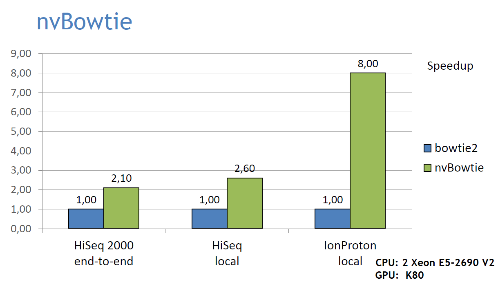

```{r setup, include=FALSE}
knitr::opts_chunk$set(echo = TRUE)
```

## Introduction

NVBIO is a library of reusable components developed by NVIDIA Corporation to accelerate bioinformatics applications using CUDA technology. Although specifically designed to harness the computational power of NVIDIA GPUs, many of its components are fully cross-platform and can be used in both host C++ and device CUDA code.

The purpose of NVBIO is twofold. It serves as a robust foundation for developing modern GPU-focused applications, ensuring that core computations delegated to the library automatically benefit from advances in GPU technology. At the same time, it provides valuable resources for designing novel bioinformatics algorithms tailored to massively parallel architectures.

In addition to its core components, NVBIO includes a suite of applications built on top of the library. Among these is nvBowtie, a re-engineered implementation of the widely recognized Bowtie2 short-read aligner ^[Langmead, B., & Salzberg, S. L. (2012). Fast gapped-read alignment with Bowtie 2. Nature methods, 9(4), 357-359.]. Unlike many prototypes, nvBowtie is built as an industrial-grade aligner, replicating most of Bowtie2’s original features while adding enhancements such as efficient support for direct BAM output, with future plans for CRAM support.

## Performances

nvBowtie is designed to fully exploit the massive parallelism of modern GPUs, delivering significantly higher alignment throughput without compromising accuracy, or achieving even greater accuracy in the same amount of time. For example, its performance was compared to Bowtie2 using an Illumina HiSeq 2000 dataset (the first 10 million reads of ERR161544) and an IonProton dataset, applying both end-to-end and local alignment methods. The results demonstrate an impressive 99.98% agreement at high MAPQ scores. For comparison, Bowtie2 tests were performed using 20 CPU threads with default alignment settings.

```{r fig.cap="benchmark", fig.alt = "benchmark."}

```


### RBowtieCuda

This package provides an R wrapper for [nvBio/nvBowtie](https://github.com/NVlabs/nvbio), offering user-friendly interfaces specifically designed for R users. To maximize efficiency, the indexing and alignment functions (nvBWT and nvBowtie) are implemented in C++ and seamlessly integrated into R using the system2 function. This integration is fully transparent to the user, ensuring that the package is easy to use while providing high-performance features optimized to take full advantage of your machine's capabilities.

Additionally, an experimental implementation of the `Wavefront Alignment (WFA)` method ^[Marco-Sola S, Moure JC, Moreto M et al. Fast gap-affine pairwise alignment using the wavefront algorithm. Bioinformatics 2021;37: 456–63.] is included and can be accessed by using the ```--wfa``` parameter during execution.

Please note that this package requires an NVIDIA graphics card for proper functionality.


## Additional Installation Instructions

For detailed installation steps, please refer to the INSTALL file included with the package.

RbowtieCuda is compatible with all Cuda versions greater than or equal to 10.

## An Example Workflow Using RbowtieCuda

### Installation

To install the latest version of RbowtieCuda, ensure that you are running the most up-to-date version of R. As RbowtieCuda is part of the Bioconductor project, you can easily install it along with its dependencies by following these steps:

```
library(BiocManager)
BiocManager::install("RbowtieCuda")
```

As with any other R package, you need to load RbowtieCuda each time before using it, like this:

```{r loading}
library(RbowtieCuda)
```

### nvBWT : Building BWT Indices for Reference FASTA Files

nvBWT is an application developed as part of the NVBIO library, designed to perform BWT-based reference indexing for nvBowtie and potentially other FM-index-based applications. When provided with one or more FASTA files, nvBWT generates both the forward and reverse Burrows-Wheeler Transform (BWT), along with a 2-bit packed representation of the sequences. In addition, it produces several auxiliary indices to support efficient alignment and querying.

#### Example:

```{r idad}
td <- tempdir()
fa_file <- system.file(package="RbowtieCuda", "extdata", "bt2", "refs", "lambda_virus.fa")
nvBWT(myinput=fa_file, output=file.path(td, "index"), options="")
```

will generate the following files:

```
index.pac
index.rpac
index.bwt
index.rbwt
index.sa
index.rsa
index.ann
index.amb
```

Warning: if you run the command in a directory that already contains these files, they will be deleted and new files will be generated.

nvBWT supports the following command options:
```
-v       | --verbosity     int (0-6) [5]     // select the verbosity level
-m       | --max-length    int       [inf]   // clamp input length
-b       | --byte-packing                    // output a byte-encoded .pac file
-w       | --word-packing                    // output a word-encoded .wpac file (more efficient)
-c       | --crc                             // compute CRCs
-d       | --device                          // select a cuda device
```

### nvBowtie Alignments:

nvBowtie is a GPU-accelerated re-engineering of Bowtie2, one of the most widely used short-read aligners. Completely rewritten from scratch, nvBowtie retains many of the key features of Bowtie2, though not all functionalities are replicated.

Designed to fully exploit the massive parallelism of modern GPUs, nvBowtie achieves significantly higher alignment throughput without sacrificing accuracy—or offers even greater accuracy within the same time frame. Despite its focus on performance, nvBowtie is carefully designed to align closely with Bowtie2 in terms of specificity and sensitivity, maintaining the same level of reliability for users.

To harness the computational power of modern processor architectures, nvBowtie re-implements the algorithms underlying Bowtie2 but adopts a fundamentally different approach. While Bowtie2 is optimized to process one read at a time—using multiple CPU threads to handle different reads simultaneously—nvBowtie operates on large batches of reads, treating their alignment as a pipeline. This pipeline consists of many relatively simple but highly parallel stages, each optimized for execution on GPUs. In several stages, the parallelism extends far beyond the read level, processing multiple candidate hits for each read simultaneously, enabling a much finer granularity of parallel computation.

#### New features :

We’ve introduced several new functions to nvBowtie. You can now perform alignments using the WFA method by including the ```--wfa  (or --scoring wfa)``` parameter. The WFA method requires a large amount of RAM on the graphics card. We therefore recommend using an Nvidia card with 8GB or more. Please note that this feature is still experimental; it currently supports only end-to-end alignments and does not yet allow customization of scoring parameters. By default, it uses the following scoring:  match:0, mismatch:1, gap_open:1 and gap_ext:1.

Additionally, the ```--cache-writes``` parameter optimizes disk write operations, resulting in faster alignments. This functionality requires 4GB of RAM and is limited to paired-end alignments.

#### Example :

Reads_1 and Reads_2 represent raw paired-end read files in FASTQ format. Using a nvBWT index, these reads are mapped to the reference genome by invoking nvBowtie. The resulting alignments are stored in a BAM file, with its file path specified by the output parameter.

```{r bt2bd1}
read_1 <- system.file(package="RbowtieCuda", "extdata", "bt2", "reads", "reads_1.fastq")
read_2 <- system.file(package="RbowtieCuda", "extdata", "bt2", "reads", "reads_2.fastq")
nvBowtie(file.path(td, "index"), file.path(td, "my_result.bam"), options="", seq1=read_1, seq2=read_2)
```

#### Indexing of bam files produced by nvBowtie

nvBowtie does not automatically generate the .bai index files that are typically associated with .bam files.

These index files are essential for visualizing .bam files in tools such as the Integrative Genomics Viewer (IGV).

Fortunately, this issue can be easily resolved using the Rsamtools package, which includes the required functionality. For example, if you have generated a file named results.bam, you can create the corresponding index file with a simple command.

You only need to run the following in R:

```
library(Rsamtools) 
sortBam("results.bam", "results")
indexBam("results.bam")
```

#### 

#### Options and Version of the nvBowtie Aligner

You can customize the alignment process by adjusting the available options, enabling you to optimize performance and accuracy according to your specific needs:

```{r bt2usage}
nvBowtie_usage()
```

You can execute unit tests for the program using the following commands or tools, ensuring its functionality and correctness:

```{r bt2tests}
nvbio_tests()
```

And you can obtain version information by executing the following command:

```{r bt2version}
nvBowtie_version()
```

## Session Information

```{r sessioninfo}
sessionInfo()
```


## Acknowledgement

We would like to thank Ismael Galve Roperh for his assistance.


## Credits

The main contributors of the original NVBIO are:

    Jacopo Pantaleoni - jpantaleoni@nvidia.com
    Nuno Subtil - nsubtil@nvidia.com

RbowtieCuda developers:

    Samuel Simon Sanchez - samsimon@ucm.es
    Franck RICHARD - franck.richard@winstars.net

The maintainer of the RbowtieCuda package is [Franck RICHARD](mailto:franck.richard@winstars.net)


## Website

A dedicated website with helpful resources for the RbowtieCuda package is available [here](https://belacqua-labo.ovh/bioinformatic/RbowtieCuda), and a github copy [here](https://github.com/FranckRICHARD01/RbowtieCuda)


## References

[1] Langmead, B., & Salzberg, S. L. (2012). Fast gapped-read alignment with Bowtie 2. Nature methods, 9(4), 357-359.

[2] Marco-Sola S, Moure JC, Moreto M et al. Fast gap-affine pairwise alignment using the wavefront algorithm. Bioinformatics 2021;37: 456–63.